<div align="center">
  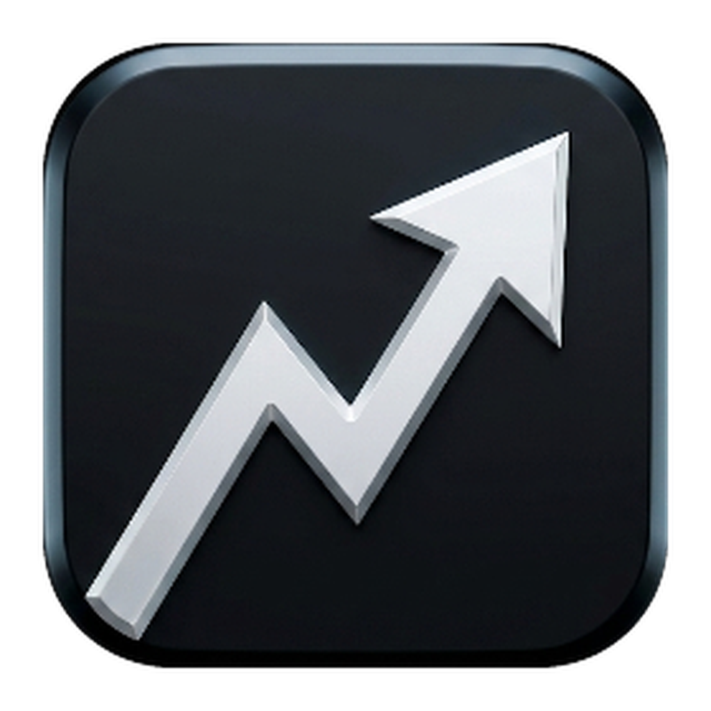
  <h1>Metrics</h1>
  <p>A transparent, always-on-top desktop overlay that displays real-time stock quotes.<br/>
  Built with Electron for Windows and macOS.</p>
  <p><b>English</b> · <a href="README.ko.md">한국어</a></p>
  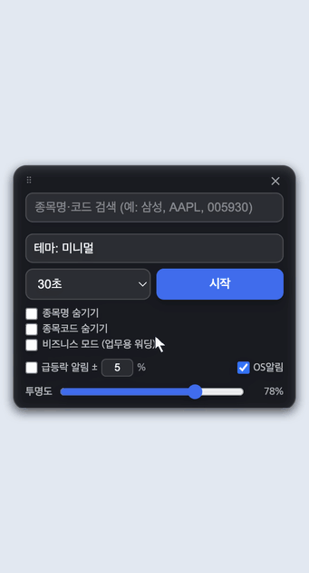
  <p><sub>Searching for 삼성전자, adding it with a cost basis and a target price, and starting the overlay.</sub></p>
  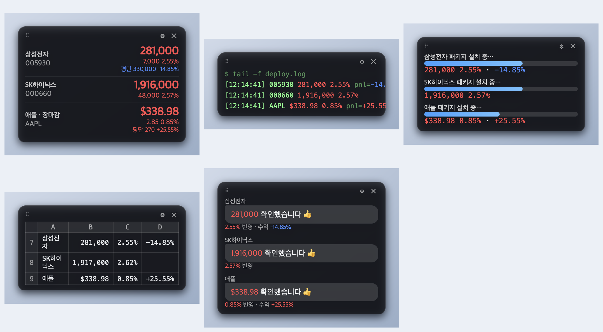
</div>

> **Note** — the application interface is currently available in Korean only. This README is available in both English and Korean.

---

## Features

- **Korean and US markets** — KRX, NASDAQ and NYSE symbols
- **Search by name** — look up `삼성`, `apple` or a ticker code directly; no need to know the symbol code
- **Multiple symbols** — quotes are stacked vertically in a single window
- **Automatic refresh** — every 30 seconds or every minute
- **Return on cost basis** — enter an average purchase price per symbol to display the current return
- **Price alerts** — a per-symbol target price with automatic crossing detection in both directions, plus a surge/drop alert on the daily change rate, delivered as native OS notifications
- **Transparent and draggable** — frameless window, always on top, movable anywhere on screen
- **Adjustable opacity** — 10–100%
- **Five layout themes** and an **alternate label mode** (see [Display modes](#display-modes))
- **Optional hiding** of symbol names and codes
- **Persistent settings** — the symbol list, cost basis values and all options are saved automatically

Colors follow the Korean convention: **red for a rise, blue for a decline**. US symbols use the same convention for consistency.

---

## Requirements

- Node.js 18 or later
- Windows 10/11 (x64) or macOS 11 or later (Apple Silicon and Intel)

---

## Installation

```bash
npm install
npm start
```

---

## Usage

### 1. Adding symbols

The settings panel opens on launch.

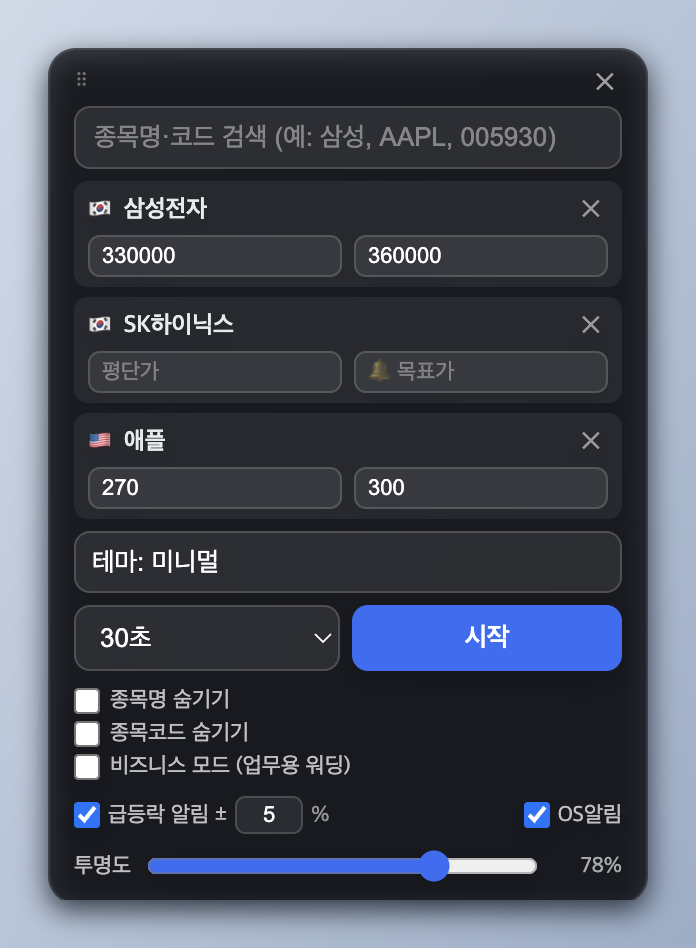

Entering a name or a code in the search box returns matches from both markets. Each result carries a 🇰🇷 or 🇺🇸 badge; symbols listed on other exchanges are returned as well and marked 🌐.

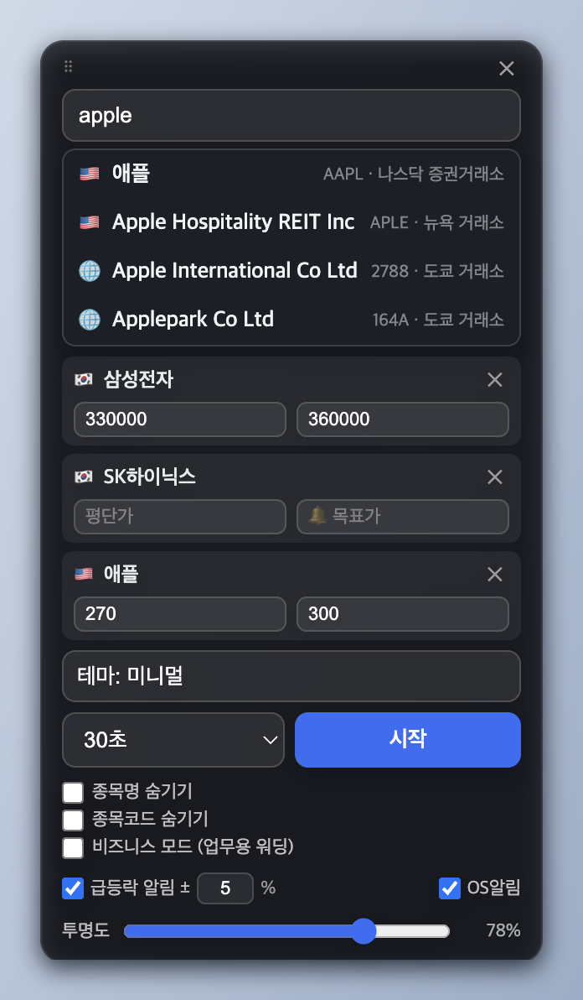

1. Type a query such as `삼성`, `apple` or `005930`, then click a result to **add it to the list**
2. Optionally enter an **average purchase price** and a **🔔 target price** for each symbol
3. Add as many symbols as needed (`✕` removes one)
4. Select a **theme** and a **refresh interval** (30 seconds or 1 minute)
5. Optionally toggle **name/code hiding**, the **alternate label mode**, the **surge/drop alert** threshold, **OS notifications**, and **opacity**
6. Click **시작 (Start)**

### 2. The quote window

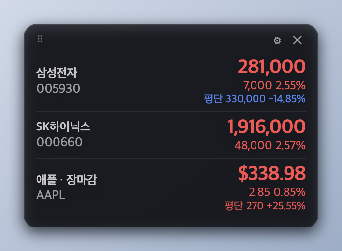

- Prices are **red on a rise and blue on a decline**; US symbols are prefixed with `$`
- When a cost basis is set, the return is shown beneath the price, e.g. `평단 330,000 -14.85%`
- `· 장마감` is appended to any symbol whose market is currently closed, in either country
- **Drag the window** to reposition it
- **⚙** returns to the settings panel, **✕** quits

---

## Alerts

Two independent triggers are available. Both are delivered as native OS notifications — Notification Center on macOS, toast notifications on Windows.

**Target price** — enter a 🔔 target price for a symbol and the alert fires when the price crosses it. Crossings are detected in both directions, so no separate above/below setting is required. Once fired, the alert re-arms only after the price moves more than 1% away from the target, so a symbol hovering around its target does not generate repeated notifications.

**Surge / drop** — fires when the daily change rate reaches ±N%, 5% by default.

The first poll after starting establishes a baseline only and never fires. Conditions that were already met when the overlay was started therefore do not produce an alert.

Notifications are rewritten under the alternate label mode as well: the title becomes `Metrics` instead of `📈 시세 알림`, and `목표가 도달` becomes `임계값 도달`. No market terminology remains in the notification banner.

---

## Themes

Themes are selected from the `테마` dropdown. Returns and the hiding options behave identically across all of them. Note that the spreadsheet theme renders every value in a single color; the other four apply the rise/decline colors.

| Theme | Preview |
|-------|---------|
| **Minimal** — the default quote window |  |
| **Terminal** — log tail output | 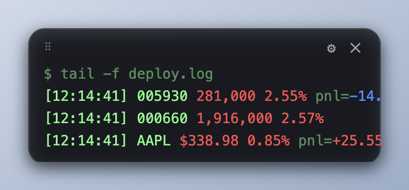 |
| **Build progress** — package installation progress bars | 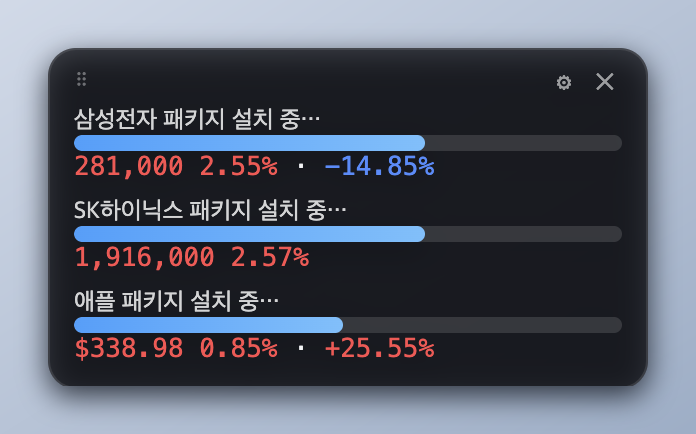 |
| **Spreadsheet** — spreadsheet cells | 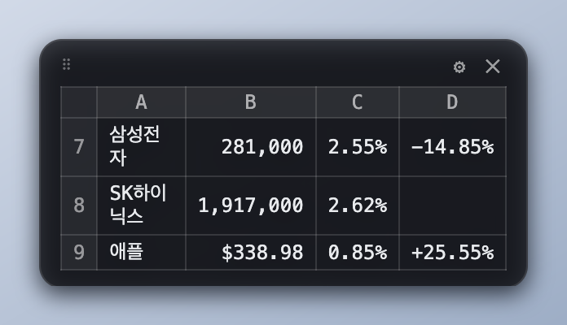 |
| **Chat** — messenger bubbles | 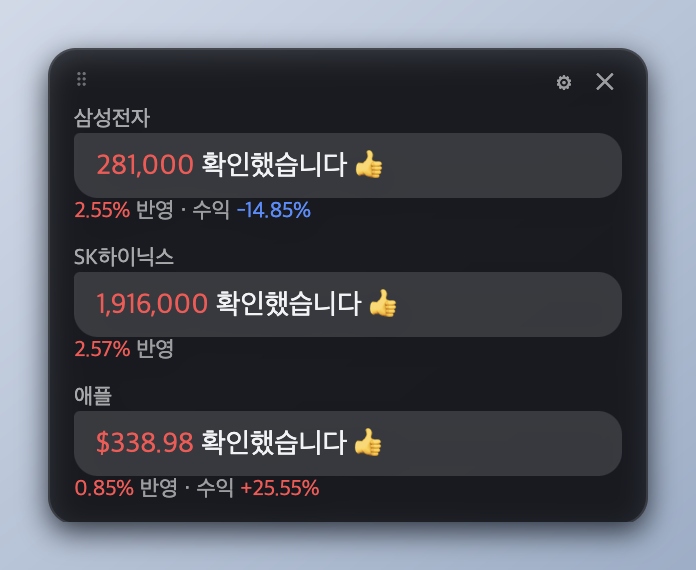 |

---

## Character mode

Places a character on the desktop with the current price and return of the selected symbol above its head. Enable it from **캐릭터 모드** in the settings panel.

- The character stands still by default. `└ 알아서 돌아다니기` lets it wander across the screen
- **Click the character** to take control — `← →` to move, `↑` to jump, `F` to punch, `G` to throw a ball, `Esc` to release
- It can be dragged, and falls back to the floor when released
- Its expression and body color follow the return

### Sharing with friends

Characters of friends connected to the same room appear on your screen, and you can punch them or hit them with a thrown ball.

Connections use Supabase Realtime. **No connection details are stored in this repository.** Whoever opens the room creates a free project and shares an invite code.

**Room host**

1. Create a project at [supabase.com](https://supabase.com) — the free plan is sufficient
2. Copy both values from the **Connect** button at the top of the dashboard, or from **Settings**
   - **Project URL** — the `API URL` / `Project URL` under **Settings → Data API**, in the form `https://xxxxxxxx.supabase.co`. A trailing path such as `/rest/v1` can be pasted as-is
   - **Publishable key** — starts with `sb_publishable_`
     (Older projects have an `anon` `public` key instead — a long string starting with `eyJ`, which works as-is)
3. Click `코드 만들기` in the settings panel and enter both to generate an invite code
4. Send that code to your friends

> **Never use a key starting with `sb_secret_`, or a `service_role` key.** Such a key bypasses every security policy, and the invite code is meant to be handed to friends, so it would leak directly. The app rejects these on entry, but it is better not to copy one in the first place.

**Friends**

Paste the invite code, enter a name, and click `연결`.

> Only the relative on-screen position (0–1), facing direction, name and **return percentage** are transmitted. Cost basis, quantity and amounts are never sent and stay on each device.

Position is sent 10 times per second only while the character is moving, and nothing is sent while it stands still — which is why the free plan's message allowance is ample.

---

## Display modes

The **alternate label mode** (`비즈니스 모드`) replaces market terminology with neutral metric terminology, so the overlay reads as a generic dashboard rather than a quote window.

| Default | Alternate |
|---------|-----------|
| 평단 | `baseline` |
| 수익률 | `rate` |
| 변동 | `delta` |
| 장마감 | `synced` |
| 항목 | `metric` |

Combined with the name and code hiding options, no symbol identifiers remain on screen. The example below uses the spreadsheet theme with both options enabled:

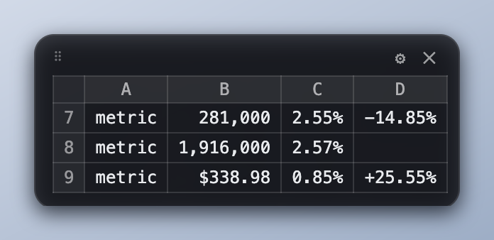

> The label text is defined in the `LABELS` dictionary in [`renderer.js`](renderer.js) and can be changed freely.

---

## Building

### Windows — installer (.exe)

```bash
npm run dist:win
```

Output: `dist/Metrics Setup 1.0.0.exe` (x64 NSIS installer)

### Windows — portable archive (.zip)

```bash
npm run dist:win:zip
```

Output: `dist/Metrics-1.0.0-win.zip` (x64, no installation required)

Extract the archive and run `Metrics.exe` from the extracted folder. The entire folder must be kept together — the executable depends on the adjacent DLLs and the `resources` directory.

### macOS — disk image (.dmg)

```bash
npm run dist:mac
```

Output: `dist/Metrics-1.0.0-universal.dmg` (universal binary, Apple Silicon and Intel)

### Code signing

The distributed binaries are **not signed with a paid certificate and are not notarized**, so both operating systems will warn on first launch:

- **Windows** — SmartScreen displays a warning. Select `More info` → `Run anyway`.
- **macOS** — the build applies an ad-hoc signature, which is required for the application to run at all on Apple Silicon. Gatekeeper still reports an unidentified developer, so the first launch must be approved with **right-click → Open → Open**.

| Platform | Artifact |
|----------|----------|
| Windows (installer) | `dist/Metrics Setup 1.0.0.exe` |
| Windows (portable) | `dist/Metrics-1.0.0-win.zip` |
| macOS | `dist/Metrics-1.0.0-universal.dmg` |

No API keys or additional configuration are required.

---

## Customization

- **Application name and version** — edit `build.productName` and `version` in `package.json`, then rebuild
- **Icons** — run `python3 make-icon.py <source image>` (requires Pillow) to regenerate `build/icon.png`, `icon.ico` and `icon.icns`
- **Screenshots** — run `npx electron scratch_capture.js`, then `python3 scratch_compose.py`
- **Demo animation** — run `npx electron scratch_demo.js` (records the interaction against the live app), then `python3 scratch_demo_gif.py`
- **Quote source** — the request logic is contained in `fetchQuote` in `main.js` and in `naver.js`

---

## Data source and disclaimer

Quotes are retrieved from **undocumented Naver Finance endpoints** (`polling.finance.naver.com`, `m.stock.naver.com`). These endpoints are not a public API and may change or become unavailable without notice.

This project is not affiliated with, endorsed by, or connected to Naver in any way. Quote data is provided without any guarantee of accuracy, completeness or timeliness, and may be delayed. **It must not be relied upon for investment decisions.** Use of this application is entirely at the user's own risk.

---

## License

[MIT](LICENSE)
